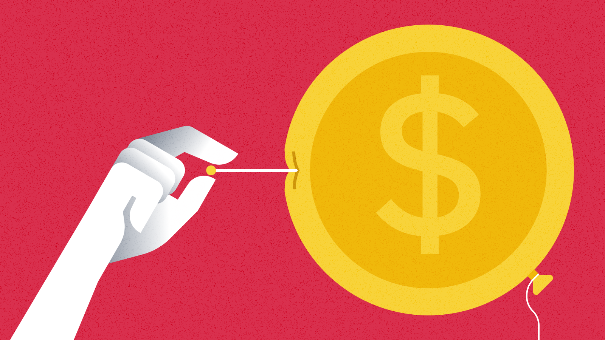

# 什么是通货膨胀？

### 导语

您有没有听祖母说过她年轻时什么东西都很便宜？原因正是通货膨胀。产品和服务的供求不规范造成了这一现象，从而导致了价格上涨。

通货膨胀有其优点，但总体而言，通胀过高是一件坏事：如果您的钱明天便会贬值，那么为什么要存钱呢？为了管控通货膨胀过高的情况，各国政府均会部署旨在减少消费的政策。

目录

导语
通货膨胀的成因
需求拉动型通货膨胀
成本推动型通货膨胀
固有型通货膨胀
通货膨胀的补救措施
提高利率
改变财政政策
用物价指数衡量通货膨胀
通货膨胀的优缺点
通货膨胀的优点
通货膨胀的缺点
总结

### 导语
通货膨胀可定义为某一货币的购买力下降。即某一经济体中商品和服务的价格持续上涨。
“相对价格变动”通常意味着只有一两种商品价格上升，而通货膨胀则是指经济体中几乎所有商品均成本上涨。此外，通货膨胀属于长期现象，即物价上涨必须处于持续状态，而不仅仅是偶发事件。

大多数国家/地区每年均会对通货膨胀率进行测定。通常，您看到的通货膨胀率以百分比变化表示：即相对于前一时期的增长或下降。

在本文中，我们将讨论通货膨胀的不同成因、衡量方法及其可能对经济产生的影响（包括正面和负面）。

## 通货膨胀的成因
在基础层面上，我们可以得出通货膨胀的两个常见成因。首先，流通（供应）中的实际货币数量迅速增加。例如，当欧洲殖民者在 15 世纪征服西半球时，金条和银条涌入欧洲，由此导致了通货膨胀（供应量过高）。
其次，由于某种需求量大的特定商品出现供应短缺，也可能会发生通货膨胀。然后，这可能会引发该类商品价格上涨，从而有可能波及经济体的其他领域。其结果可能导致几乎所有商品和服务的价格普遍上涨。

但如果深入研究，我们会发现，导致通货膨胀的事件可能存在着不同的类型。在这里，我们将其区分为需求拉动型通货膨胀、成本推动型通货膨胀和固有型通货膨胀。此外还有其他变体，但上述通胀均为经济学家罗伯特·J·戈登 (Robert J.Gordon) 提出的“三角模型”中的主要类型。

## 需求拉动型通货膨胀
需求拉动型通胀是最常见的通货膨胀，其成因是消费增加。在这种情况下，需求超过了商品和服务的供应，而该现象导致了价格上涨。

为了说明这一点，我们来思考一下面包师在市场中出售面包的情景。这位面包师每周能制作大约 1,000 个面包。这是经营良好的情况，因为他每周都会卖出大约这个数量。

但假设面包的需求量大幅增长。或许经济状况有所改善，意味着消费者有更多的钱消费。因此，我们很可能看到面包师出售的面包价格上涨。

为什么？因为制作 1,000 条面包时，我们的面包师处于满负荷运转的状态。他的员工和烤箱的实际产量均无法超出这个数字。他可以配置更多烤箱，雇佣更多员工，但这需要时间。

目前来不及，我们的顾客太多，面包不够。某些顾客愿意为购买面包支付更高的价格，所以面包师相应提高价格也就再自然不过了。

现在，除了面包需求量增加外，想象一下经济状况改善也导致了牛奶、油和其他几种产品的需求量有所增长。这便是需求拉动型通货膨胀的定义。人们购买的商品越来越多，导致供不应求，价格随之上涨。

## 成本推动型通货膨胀
当原材料或生产成本增加导致价格水平上涨时，便会出现成本推动型通货膨胀。顾名思义，这类成本被“推”给了消费者。

我们回到之前面包师的情况。他配置了新的烤箱，雇佣了额外的员工，每周可生产 4,000 个面包。目前，供应迎合了需求，皆大欢喜。

一天，面包师听到了一些不幸的消息。本季小麦收成尤其糟糕，这意味着该地区所有面包店均供应不足。这位面包师必须为生产面包所需的小麦支付更高的费用。有了这笔额外的支出，他需要提高收取的价格，但消费者的需求并未增长。

另一种可能性是政府提高了最低工资标准。这增加了面包师的生产成本，因此，他必须再次提高现有面包的价格。

从宏观上看，成本推动型通货膨胀的成因通常是资源（如小麦或油）短缺、政府对商品税收增加或汇率下降（导致进口成本更高）。

## 固有型通货膨胀
固有型通货膨胀（又称为惯性通货膨胀）是一种由过去经济活动引发的通货膨胀。因此，如果前两种形式的通货膨胀随着时间推移而持续存在，则可能会触发这类通胀。固有型通货膨胀与通胀预期以及物价工资螺旋上升的概念密切相关。 
上述观点中的第一个概念是指，在经历一段时间的通货膨胀之后，个人和企业预计通胀将在未来持续存在。如果前几年出现通货膨胀，员工更有可能协商加薪，从而导致企业对其产品和服务收取更高费用。
物价工资螺旋上升的概念说明了固有型通货膨胀会引发通胀加剧的趋势。当雇主和工人无法就工资价值达成一致时，则有可能发生这种情况。虽然工人要求加薪是为了防止其财富受到预期通胀的影响，但雇主们却被迫提高了产品成本。这可能会导致自我强化式循环，即为了应对商品和服务的成本增加，工人又会进一步要求加薪，而这种情况会不停地循环下去。

## 通货膨胀的补救措施
比特币是否为通货膨胀的解决方案

不受控制的通货膨胀可能对经济造成损害，因此各国政府免不了采取积极主动的立场来限制通货膨胀的影响。政府可以通过调整货币供应量以及改变货币政策与财政政策来实现这一点。
中央银行（如美联储）有权通过增加或减少流通金额来改变法定货币供应量。常见示例是量化宽松政策 (QE)，即中央银行购买银行资产，向经济中注入新印钞票。这一措施实际上会加剧通货膨胀，因此存在通胀问题时不予采用。
量化宽松政策的对立面是量化紧缩 (QT)，这是一种通过减少货币供应量来降低通货膨胀的货币政策。然而，几乎没有证据支持 QT 是应对通胀的良方。实际上，大多数中央银行通过提高利率来控制通货膨胀。

## 提高利率
更高的利率使得借钱的成本更高。因此，信贷对消费者和企业的吸引力下降。在消费者层面，利率上升会抑制消费，导致商品和服务需求量减少。

储蓄在这种时期更具吸引力，而对于靠借钱赚取利息的人而言，这更是一件好事。然而，经济增长可能会受到限制，因为企业和个人在借贷投资或消费时会更加谨慎。

## 改变财政政策
虽然大多数国家/地区利用货币政策来控制通货膨胀，但改变财政政策也不失为一种选择。财政政策是指政府为影响经济而进行的消费和税收调整。 
例如，如果政府增加征收的所得税，那么个人的可支配收入便会再次减少。这会反过来减少市场的需求，理论上应该会降低通货膨胀。然而，这是一步险棋，因为公众有可能对提高税收做出不利反应。

## 用物价指数衡量通货膨胀
我们已经概述了应对通货膨胀的各类措施，但如何才能在第一时间切实认识到需要对抗通胀？显然，第一步是衡量通货膨胀。通常情况下，衡量工作通过在设定时间段内跟踪一项指数来完成。在许多国家/地区，消费者物价指数（即 CPI）是衡量通货膨胀的首选指标。
CPI 考虑了各种消费品的价格，使用加权平均值对家庭购买的一篮商品和服务进行估值。这项工作每隔一段时间便会实施，然后即可将该评分与历史评分进行比较。美国劳工统计局 (BLS) 等实体会从全国各地的商店收集此类数据，以确保计算内容尽可能准确。 

您可能会在计算中看到“基准年”的 CPI 分数为 100，然后两年后的得分为 110。然后您就可以得出结论：在两年多的时间里，价格上涨了 10%。

少量的通货膨胀未必是坏事。这是当今法定货币体系中的自然现象，而且由于通胀会鼓励消费和借贷，因此有一定的益处。然而，为了确保通胀不会对经济产生负面影响，密切关注通货膨胀率至关重要。

➟ 想要开启数字货币之旅？立即在币安购买比特币吧！

## 通货膨胀的优缺点
乍一看，通货膨胀似乎完全值得避免。但这仍属于现代经济的一部分，因此通胀在现实中是更为微妙的主题。我们来看看通货膨胀的优缺点。

## 通货膨胀的优点
增加消费、投资和借贷
如我们之前所述，轻微的通货膨胀率可以刺激消费、投资和借贷，从而使经济受益。由于通货膨胀会导致同样数量的现金在未来购买力下降，立即购买商品或服务会更有意义。

## 提高利润
通货膨胀会促使公司以更高的价格出售旗下商品和服务，以防止自身受到通胀的影响。他们有正当的涨价理由，但他们也可能会将价格提高到略高于必要的水平，从而赚取额外利润。

## 这比通货紧缩要好
我们从名称不难推断出来，通货紧缩是通货膨胀的反义词，其特点是物价会随时间推移而下降。由于价格在下降，推迟购买对消费者来说更有意义，因为他们可以在不久的将来获得更理想的价格。这可能会对经济产生负面影响，因为商品和服务的需求量没有那么大。 

从历史上看，通货紧缩时期导致了失业率上升，人们会转向储蓄而不是消费。虽然这对个人而言未必是坏事，但通货紧缩往往会阻碍经济增长。

## 通货膨胀的缺点
货币贬值与恶性通货膨胀
要想找到合适的通货膨胀率并非易事，而且一旦失去管控，可能会产生灾难性的后果。最终，这一现象会侵蚀个人所持的财富：如果您今天在床垫底下藏了 100,000 美元现金，十年后这笔钱的购买力便会大不如前。

高通货膨胀可能会导致恶性通胀，据说当一个月内物价涨幅超过 50% 时便会出现这种情况。花 15 美元购买一件几周前仅需 10 美元的基本必需品并不划算，但恶性通胀鲜少止步于此。在恶性通货膨胀时期，物价通胀率往往远超过 50%，从根本上摧毁了货币和经济。

## 不确定性
如果通货膨胀率很高，不确定性会占据主导地位。个人和企业不确定经济走向，因此会更加谨慎地使用资金，这会导致投资减少，经济增长放缓。

## 政府干预主义
有些人以自由市场原则为由，反对政府试图控制通货膨胀的观念。他们认为政府“加印新钞”（或加密货币圈内众所周知的“印钞机，冲啊！”一梗）的能力破坏了自然经济原则。

## 总结
通货膨胀的影响如此之大，以至于我们看到物价随着时间的推移而上涨，导致了生活成本上升。我们已经逐渐接受了这一现象，毕竟如果控制得当，通货膨胀可能会对经济有利。

在当今世界，最好的补救措施似乎在于灵活的财政政策和货币政策，这使得各国政府能够做出调整，以遏制物价不断上涨。然而，此类政策的实施必须慎之又慎，否则最终可能会对经济造成进一步损害。